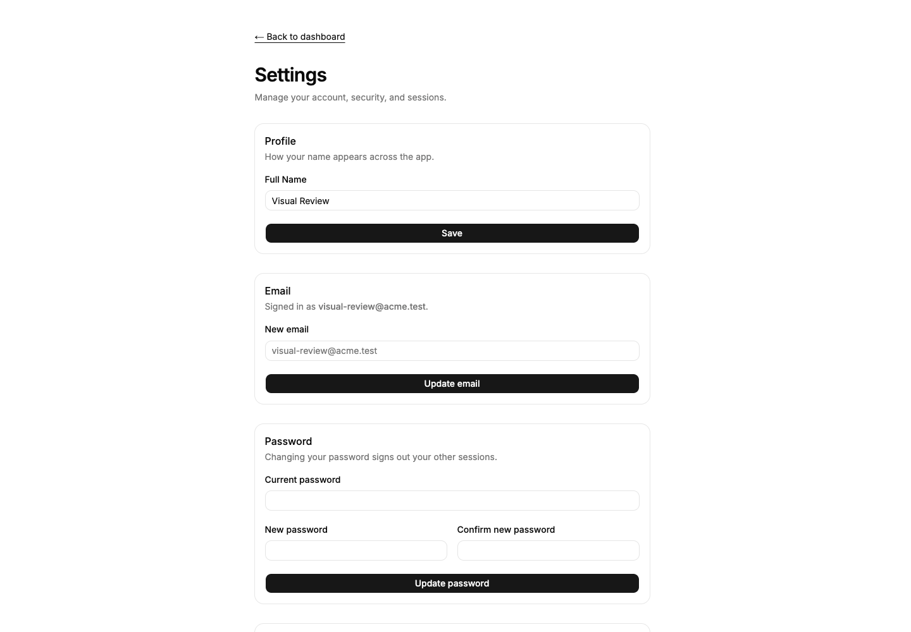
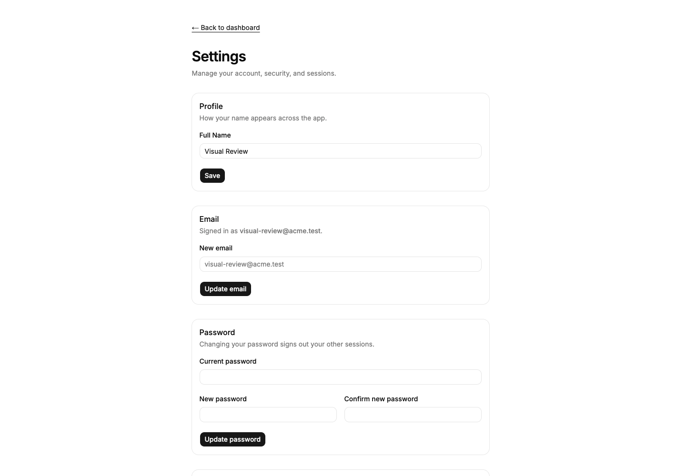
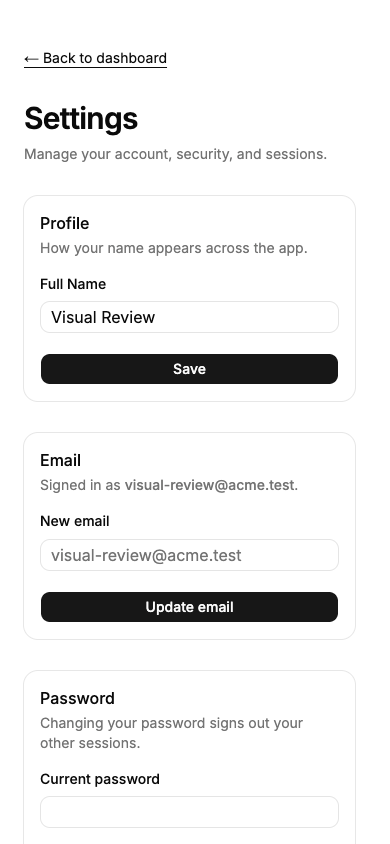
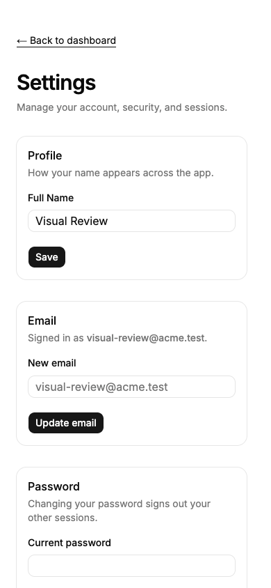
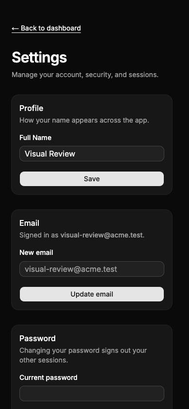
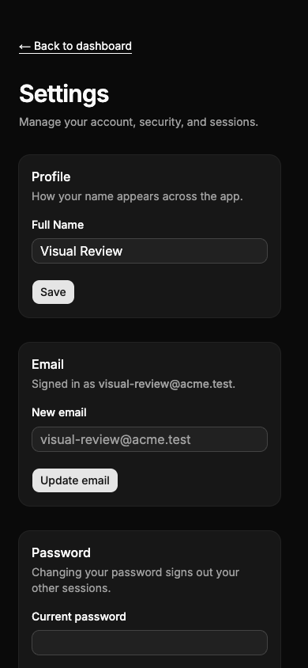

# Settings layout repair

The updated upstream Field makes every direct child full width in its default vertical orientation. That caused the profile, email, password, and delete-account actions to stretch across their cards despite the existing `w-fit`. Use the supported `orientation="horizontal"` for these four action rows. Buttons retain upstream sizes and variants, and Acme retains its explicitly requested neutral palette.

| State                    | PR base                            | Repaired                         |
| ------------------------ | ---------------------------------- | -------------------------------- |
| Settings, 1440 × 1000    |      |      |
| Settings, 390 × 844      |       |       |
| Dark settings, 390 × 844 |  |  |

PR base: `7f4241c` (merged standardization PR #233). Historical comparison: `5a4f71ddf15a5434044e90c4e0e2eddfc6c759ce`, the base of #233. All captures use a local fixture account and isolated database. No real account was changed.

The broader review covered landing hero/footer, login (including invalid submission), registration, recovery, reset form, authenticated dashboard, settings, and active sessions at 1440 and 390px. Login/settings were also exercised with a dark system preference. The historical build remained light in that preference; the current system-theme behavior and neutral palette were deliberately retained from the approved standardization.

After repair, all four actions keep their intrinsic width and the page has no horizontal overflow at 320, 390, 768, and 1440px. Lint, typecheck, and the upstream shadcn inventory passed. Upstream component files and lint policies are unchanged.
