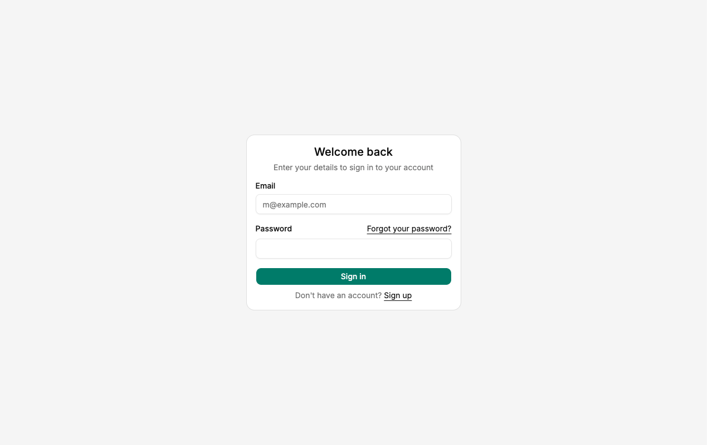
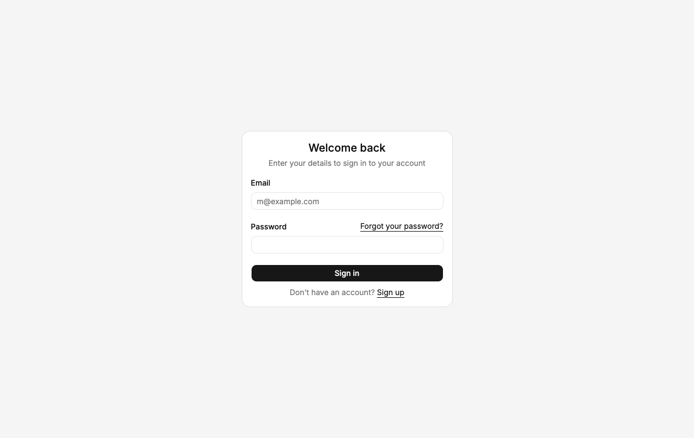
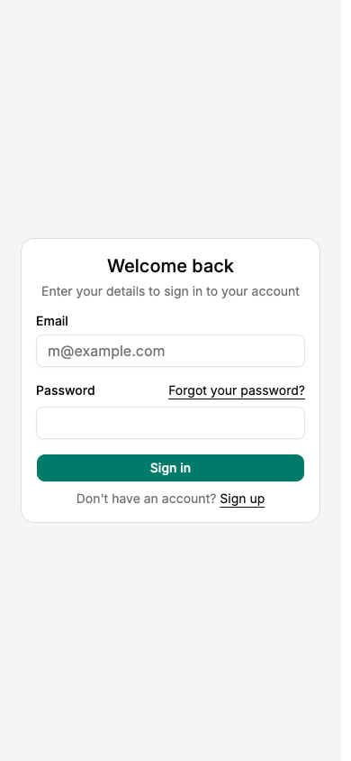
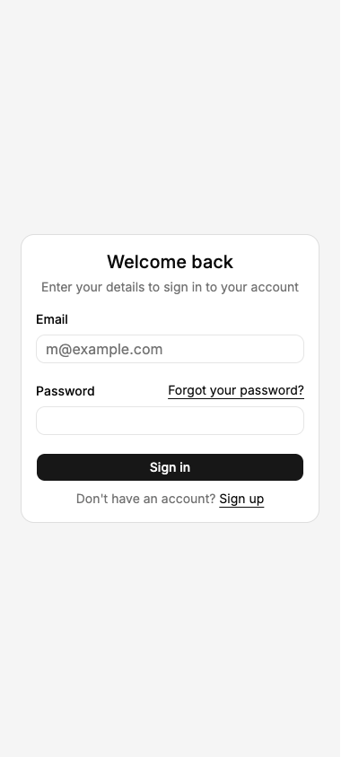
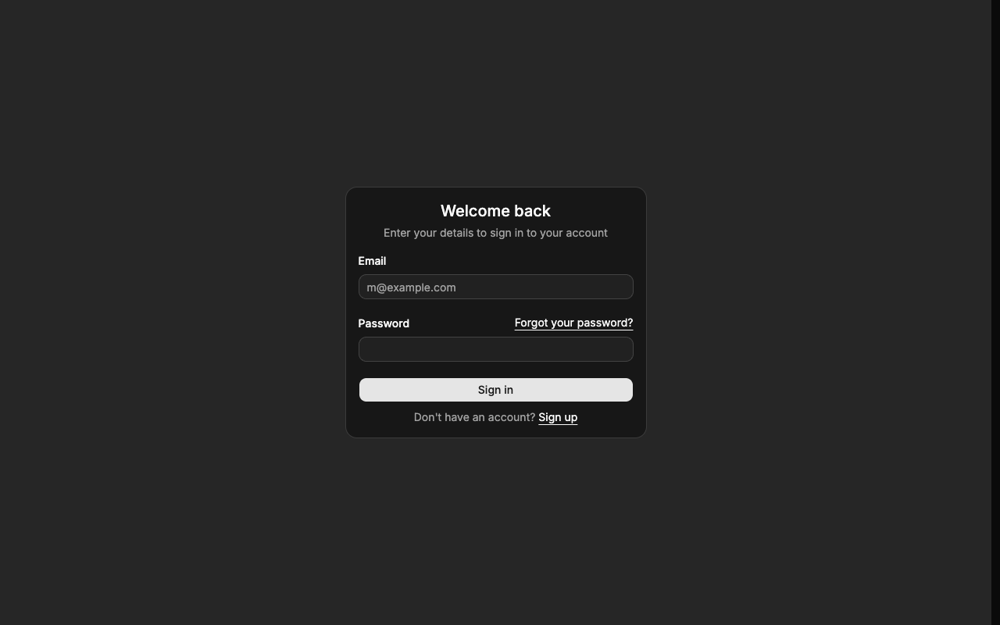
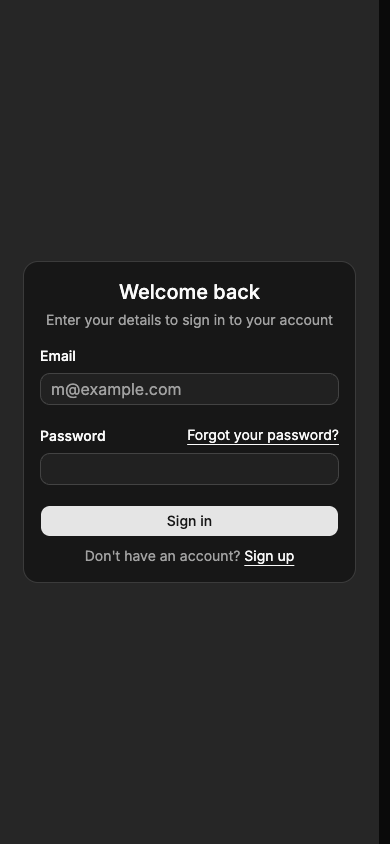
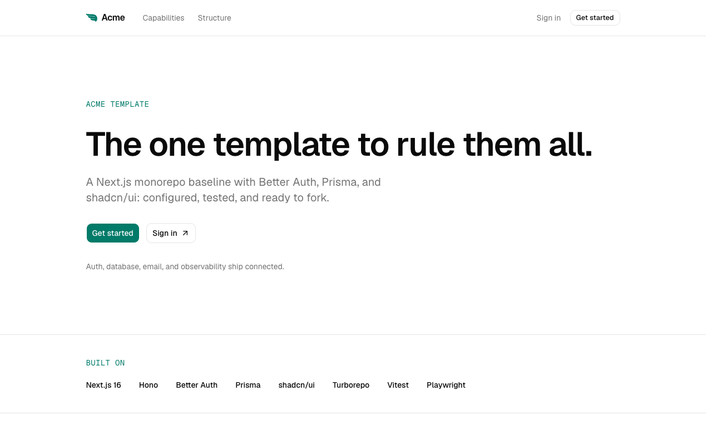
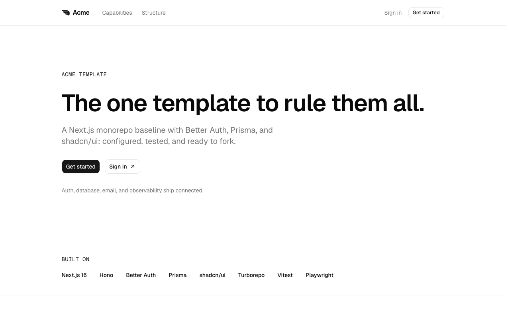
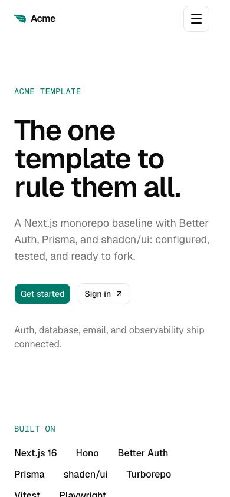
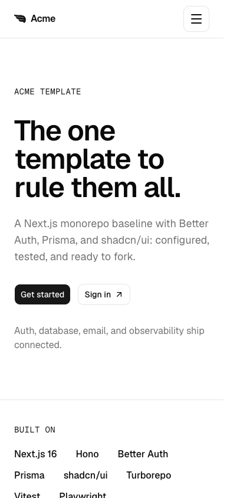

# shadcn visual comparison

Before: `5a4f71ddf15a5434044e90c4e0e2eddfc6c759ce` (PR merge base).

After UI source: `0139185e9c290393c1ce3d497b82909345fa64bd`. Later commits in this PR only add review evidence.

The jade accent is replaced with black/white/gray in light and dark modes, including primary controls, focus rings, sidebar tokens, and chart colors. Dark surfaces and borders use the neutral palette. Standard semantic red error states remain. Inputs use the stock 32px height instead of 36px and lose custom shadows; form spacing shifts slightly.

Manually compared matching desktop (1280×800) and mobile (390×844) viewports in Chromium, light mode plus dark-mode login, reduced motion. No horizontal overflow or unexpected clipping was observed in the sampled after states. This covers the pages/states below, not every screen, authenticated flow, or interaction state.

## Empty login form — light

App: `web`. Route: `/login`. Same route and state on both commits.

Desktop

| Before                              | After                             |
| ----------------------------------- | --------------------------------- |
|  |  |

Mobile

| Before                             | After                            |
| ---------------------------------- | -------------------------------- |
|  |  |

## Empty login form — dark

App: `web`. Route: `/login`. Same route and state on both commits.

Desktop

| Before                                   | After                                  |
| ---------------------------------------- | -------------------------------------- |
|  |  |

Mobile

| Before                                  | After                                 |
| --------------------------------------- | ------------------------------------- |
|  |  |

## Landing hero — light

App: `landing`. Route: `/`. Same route and state on both commits.

Desktop

| Before                                | After                               |
| ------------------------------------- | ----------------------------------- |
|  |  |

Mobile

| Before                               | After                              |
| ------------------------------------ | ---------------------------------- |
|  |  |
